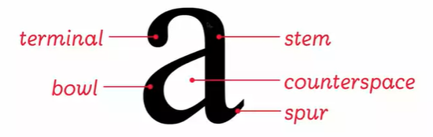

# The lexicon system

## The anatomy of letters
 
 

terminology: terminal, bowl, stem, bowl, counterspace, spur.

## Words and spacing

cap-height(T height), baseline(P) x-height.descender,ascender

tracking = letter spacing + word spacing.

## Type size: the point system

金属印刷，72 points per inch, can only choose fixed size points.

- 120,96,72,48---Headlines
- 36,24---Subheads
- 12,11,10,9---Text
- 8,6---Footnotes

## Typesetting Text

Justified, Range left, Range right.

typeface influences the typesize shown.

# Choose a typeface

regular/roman, bold, italic, bold italic

1. typeface vs. font
2. serif vs. San serif(modern)
  - Serif: Old style, transitional, Modern, Egyptian
  - Sanserif: Grotesque, Geometric, Humanist
3. Weight(Thickness)
 
