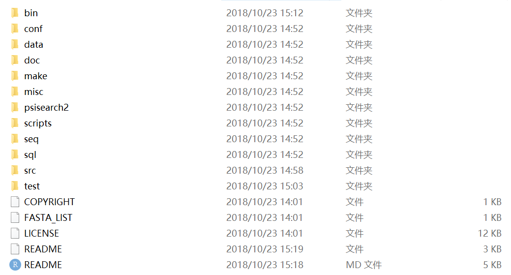

```{r klippy, echo=FALSE, include=TRUE}
klippy::klippy()
```
FASTA与BLAST类似，能够进行序列比对，内含多种比对算法，能够获得大量定量结果，帮助我们推断同源性。

## 安装

进入[Latest]( http://faculty.virginia.edu/wrpearson/fasta)，下载电脑系统对应的最新版本，解压，目录结构如下：


## 基本使用

命令行基本使用方法：

``` Bash
# the simplist command
fasta36 -options query.file library.file
# 将结果输入为文件
fasta36 -options query.file library.file > output.file

```
BP62代表BLOSUM62打分矩阵(-11/-1)


### 交互模式

通过交互模式输入测试序列文件名、序列库文件名、ktup（控制搜索速度，灵敏度）

- 蛋白质：1, 2
- DNA: 6, 3, 4

```
fasta36 -I
```

### 测试

```
# directory: d:/fasta36-36.3.8g-win32/fasta36-36.3.8g
# 测试1：交互模式
./bin/fasta36 -I

# 测试2

./bin/fasta36 ./seq/musplfm.aa ./seq/prot_test.lib
```

## custom

### 获取序列文件

在uniprot上获得目的蛋白质序列，下载为fasta格式，放置该目录下。

### 获取库文件

以获得果蝇基因组为例，在[NCBI](https://www.ncbi.nlm.nih.gov/genome/?term=Drosophila+melanogaster)上下载果蝇中所有翻译的蛋白质，文件为FASTA格式。放置fasta36目录下。

### 改变参数

options: 可用来修改打分矩阵，空位罚分，输出选项等,y以下说明一些可能会用到的可选项:

`-b #`，`#`代表数字，用来指定输出结果的数目，默认是输出所有复合E value的序列。
    
- `-S` 过滤掉低复杂序列，详细含义参见文档。
    
- `m 8` 以blast 格式展示。
    
- 其他参数请详见**fasta_guide**介绍。
    
**190923的结果即采用了上述三个参数**。

```
 ./bin/fasta36 -m 8 -b 5 -S homo_sapiens_overamplification.fasta dmel-all-translation-r6.29.fasta >test4_m8_b5_S_blastlike.csv
```
### 结果处理

1. 对照 `fasta -m 8i`的结果，为示例结果添加header。

2. 在第二列subject id FBppXXXXXXX后添加对应的果蝇的基因名字。
    - 进入[flybase转换基因ID](http://flybase.org/convert/id) 
    
    - 拷贝query id, subject id，至输入栏，提交即可获得结果，下载“validation table”，为txt格式。
    
    - 将数据读入R，处理数据。script位于项目fasta_converted_id下。
    
`d:/programming/r/projects/fasta_convert_Id`    
    
```{r,echo=TRUE,eval=FALSE}
# `d:/programming/r/projects/fasta_convert_Id`
library(readr)
library(tidyverse)
converted <- read_tsv("converted_id.txt") # read_tsv, read tab-delimited files
converted <- converted[,c(2,3)]

query_sub <- read.csv("query_sub_id.csv", 
                      header = TRUE, 
                      col.names = c("query.id", "validated_id"))

#fasta_res190923 <- read.csv("3-fasta_res190923.csv", fileEncoding = "UTF-8")

merge <- mutate(query_sub, gene_name = converted$current_symbol)
write.csv(merge, "converted_id.csv")

```
    
    