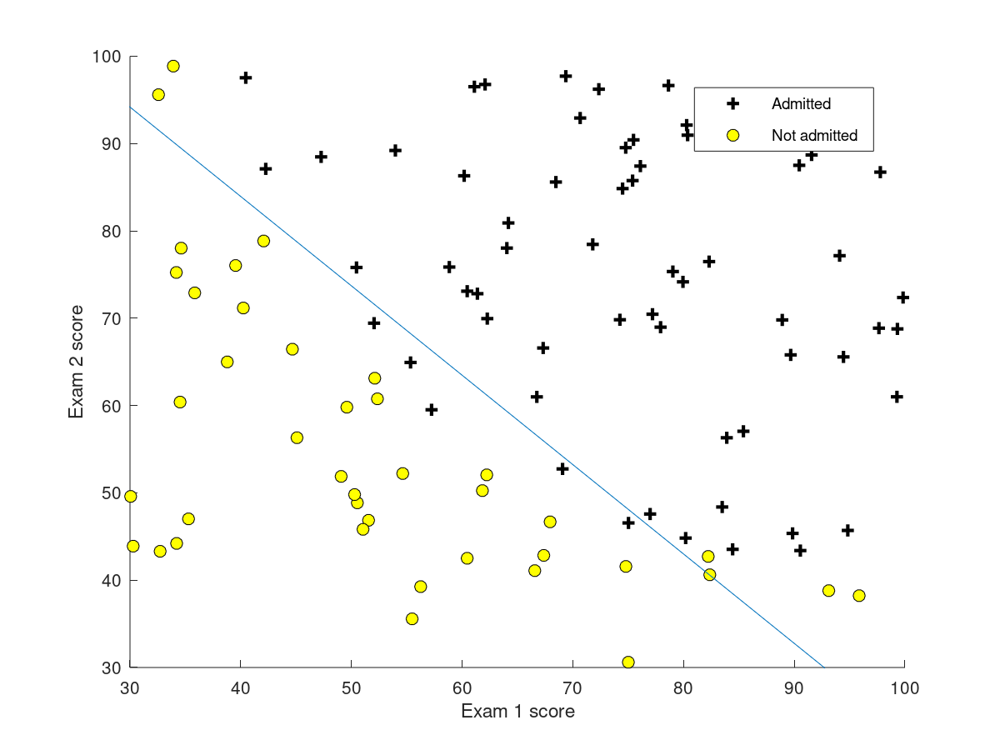

```{r klippy, echo=FALSE, include=TRUE}
klippy::klippy()
```
这是机器学习课程笔记的第三篇，内容包括：分类问题、逻辑回归（假设函数、损失函数）、梯度下降法求解$\theta$、决策边界、如何解决过拟合问题、以及多类分类问题。
希望自己能够坚持下去~

## 序言

这一章主要讲述了适用于分类问题的逻辑回归(Logistic Regression)算法。通过Logistic 函数，我们能够将样本中值对应至(0,1)，根据样本建立损失函数，按照损失函数最小原理获得最优的$\theta$,并以此建立假设函数。最后通过假设函数进行分类预测，如果预测值≥0.5，则标记为1的概率为预测值，预测为1；反之则标记为0。（注意，此时只说明0-1分类的情况）。

不难看出，逻辑回归的思路与线性回归是一致的。不同之处在于假设函数发生了变化：
$$
g(z) = \frac{1}{1+e^{(-z)}}\\
z = \theta^T X\\
h(\theta) = \frac{1}{1+e^{(-\theta^TX)}}
$$

## 逻辑回归

为了使预测值位于[0,1]，引入逻辑回归函数，调整值域。

### 假设函数

$$
h_\theta = g(\theta^Tx) \\
g(z) = \frac{1}{1+e^{-z}}
$$
```{r}
curve(1/(1+exp(-x)),from = -100, to = 100, col = "red", lwd = "2", main = "Logistic Function")
```
通过变换，所有的X值都被映射到了[0,1]范围内。

## 损失函数

$$J(\theta) = \frac{1}{m}\sum_{i=1}^{m}Cost(h_\theta(x^{(i)}),y^{(i)})\\
= -\frac{1}{m}[\sum_{i=1}^my^{(i)}logh_\theta(x^{(i)})+(1-y^{(i)})log(1-h_\theta(x^{(i)}))]$$

## 梯度下降法最小化损失函数

与线性回归法形式上完全一致：**不同之处仅在于$h_\theta(x^{(i)})$**的含义不同，即进行了映射。
$$\frac{\partial J(\theta)}{\partial\theta_j} = \frac{1}{m}\sum_{i=1}^m(h_\theta(x^{(i)})-y^{(i)})x_j^{(i)}\\\theta = \theta - \alpha\frac{\partial J(\theta)}{\partial\theta_j}$$

## 决策边界

在逻辑回归曲线中，当$x\leq0$时，$y\leq 0.5$；当$x\geq0$时，$y\geq 0.5$。由于我们以0.5作为预测的threshold，因此x = 0为边界曲线。

对于更复杂的曲线，仍可推断出。$h_\theta(x) = 0$为边界曲线。



## 过拟合问题

当产生的假设函数不能很好地拟合样本数据时，为欠拟合(Underfitting)；当假设函数对样本数据近似完美拟合，但却不能很好地预测未知数据时，则为过拟合（Overfit）。解决过拟合主要有两种方法：减少特征数目、regularization。这里介绍后一种。

### CostFunction_Reg

$$J(\theta)
= -\frac{1}{m}[\sum_{i=1}^my^{(i)}logh_\theta(x^{(i)})+(1-y^{(i)})log(1-h_\theta(x^{(i)}))]+\frac{\lambda}{2m}\sum_{j=1}^n\theta_j^2$$

### Gradient_Reg
$$
\frac{\partial J(\theta)}{\partial\theta_j} = \frac{1}{m}\sum_{i=1}^m[(h_\theta(x^{(i)})-y^{(i)})x_j^{(i)}+ \frac{\lambda}{m}\theta_j]\\
\theta = \theta - \alpha\frac{\partial J(\theta)}{\partial\theta_j}
$$

## 注意事项

1. 在用Octave实现regularization时，需要注意括号，$\lambda/2*m*\theta'\theta$ ≠ $\lambda/(2*m)*\theta'\theta$。

## 疑问

1. 在逻辑回归中，为什么使用梯度下降法不需要决定$\alpha$(下降速率)？